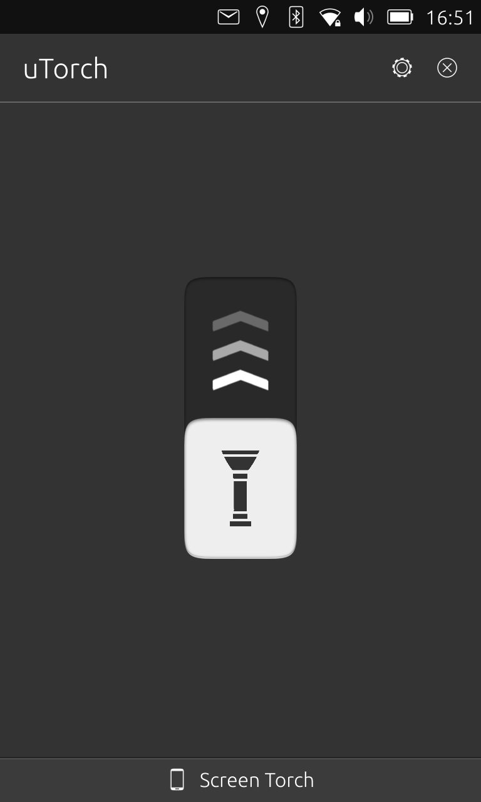
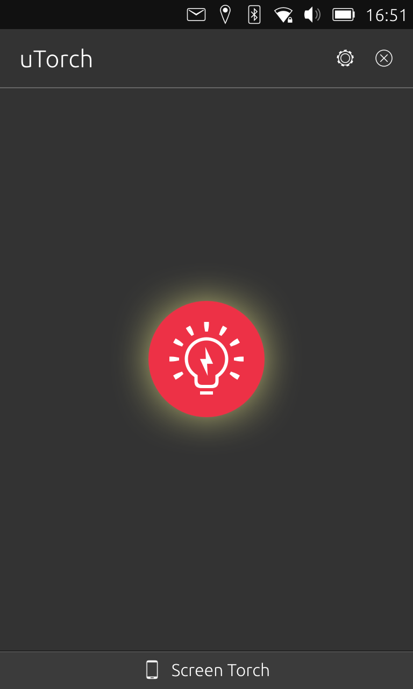
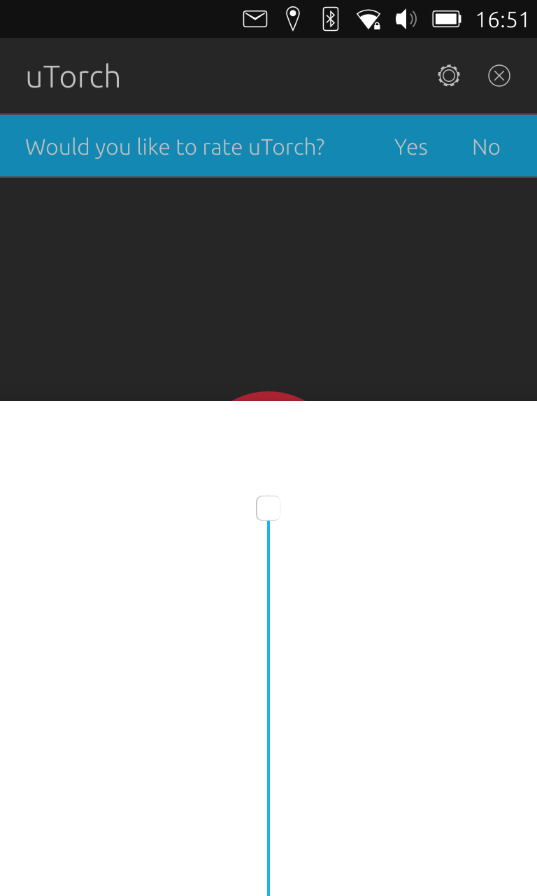
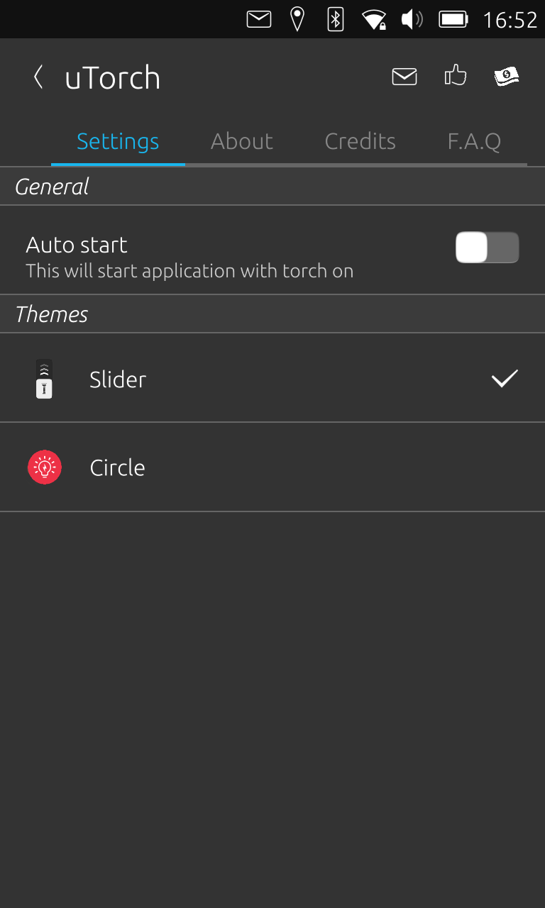
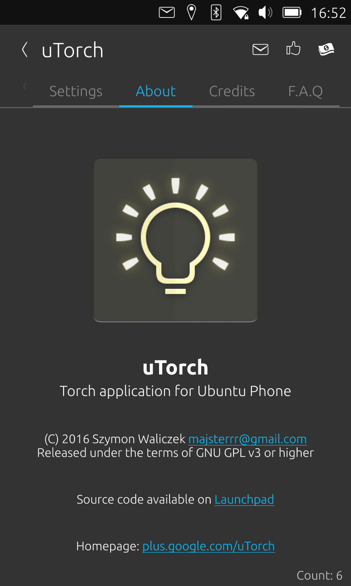
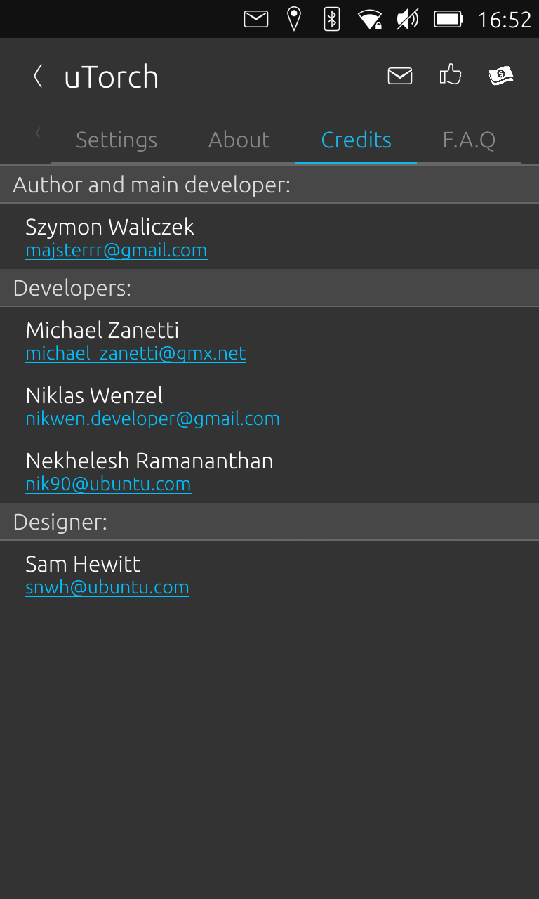
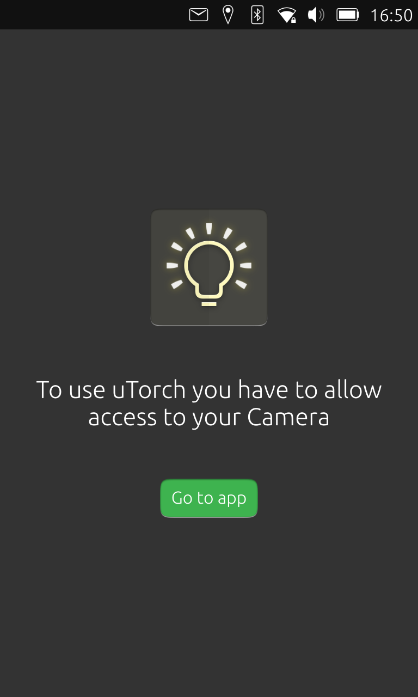

---
# uTorch
__Simple torch application for__ __[Ubuntu Touch](https://ubuntu-touch.io/)__ (mobile OS).

- Simple to use
- Absolutely free, can be downloaded from __[OpenStore](https://open-store.io/app/com.ubuntu.developer.majster-pl.utorch)__
- Screen torch (swipe up from the bottom)

---

### Pictures:
!
!
!
!
!
!
!
!
